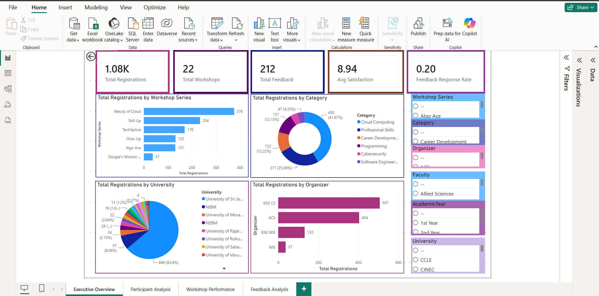
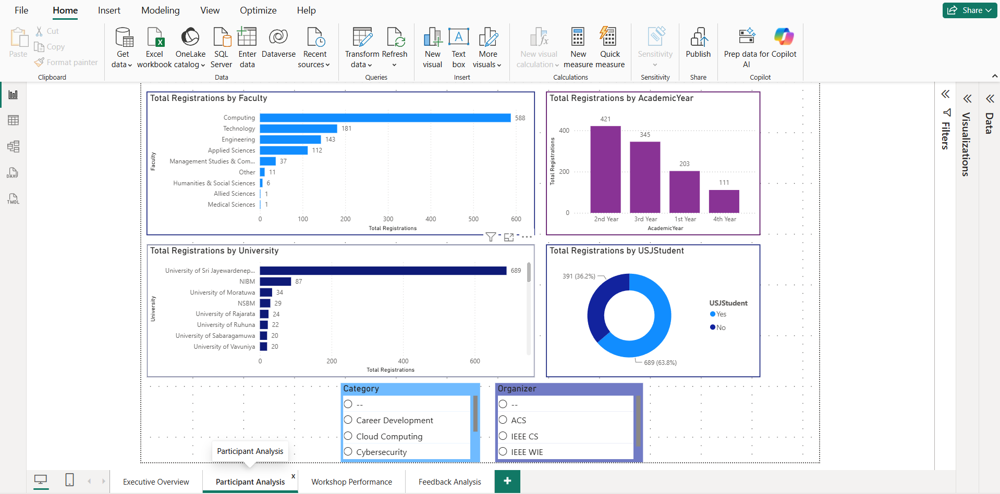
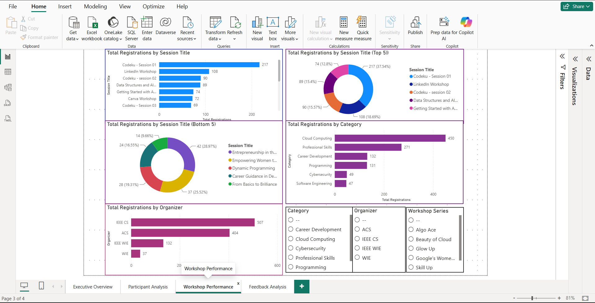
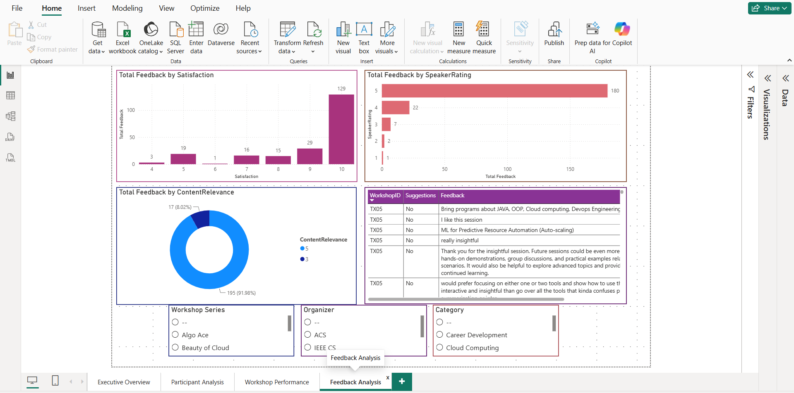

# Academic Workshops Participation and Engagement Analysis

A Business Intelligence project developed using **Microsoft Power BI** to analyze participation and engagement in technology-related academic workshops organized by student organizations at the University of Sri Jayewardenepura.

## Project Overview

Registration and feedback data from different workshops were collected in separate formats and required standardization before meaningful analysis could be performed.

This project integrates the available workshop data into a structured data model and presents the results through an interactive Power BI dashboard. The dashboard allows workshop organizers to explore participation patterns, participant demographics, workshop performance, and participant feedback.

## Dashboard

The dashboard consists of four main pages:

* **Executive Overview**: Provides an overall view of workshop participation, feedback, key performance indicators, and trends.
* **Participant Analysis**: Examines participation by university, faculty, academic year, and USJ student status.
* **Workshop Performance**: Compares workshop series, individual sessions, categories, and organizing bodies.
* **Feedback Analysis**: Evaluates participant satisfaction, speaker ratings, content relevance, and feedback responses.

## Dashboard Preview

### Executive Overview



### Participant Analysis



### Workshop Performance



### Feedback Analysis



## Key Insights

The analysis highlighted several patterns in workshop participation and engagement:

* Cloud Computing recorded the highest participation among workshop categories.
* Professional Skills was another highly engaged category.
* Students from the Faculty of Computing represented the largest participant group.
* Second-year and third-year students showed the highest participation among academic-year groups.
* The University of Sri Jayewardenepura accounted for the largest share of registrations, while the workshops also attracted participants from other universities.
* Participant satisfaction and speaker evaluations were generally high.
* The feedback response rate was considerably lower than the registration volume, presenting an opportunity to improve post-workshop feedback collection.

## Data and Methodology

The data was collected from registration and feedback forms used for technology-related academic workshops and standardized using Microsoft Excel before being analyzed in Power BI.

A **star schema** was implemented in Power BI using workshop, registration, feedback, and supporting dimension tables. DAX measures were developed for key metrics such as total registrations, feedback responses, average satisfaction, and feedback response rate.

Personal identifying information was removed before analysis.

The underlying university-provided dataset is **not included in this public repository** due to data distribution restrictions.

## Tools Used

* Microsoft Power BI
* DAX
* Microsoft Excel
* Google Forms

## Repository Contents

```text
business-intelligence-dashboard/
│
├── dashboard/
├── documentation/
├── dataset/
├── screenshots/
├── .gitignore
└── README.md
```

### Documentation

The `documentation/` folder contains the complete academic project report, including the detailed methodology, data preparation, data modeling, dashboard development, results, recommendations, and conclusion.

### Dataset

The `dataset/` folder is retained locally for project reference but is excluded from the public repository because the source data was collected from the university.

### Dashboard

The Power BI `.pbix` file is retained locally and excluded from the public repository because it contains the underlying university-provided data.

## Project Outcome

The project demonstrates how Business Intelligence can be used to transform workshop registration and feedback data into interactive visual insights that can support data-driven evaluation and future workshop planning.

## Author

**Kemitha Krishmanthi**

Bachelor of Computing in Information Systems
University of Sri Jayewardenepura
